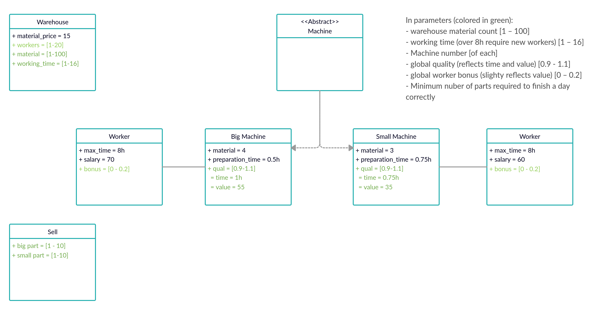

# Factory

**Important:**
Due to Github problems with markdown we recomend checking out [jupyter notebook](README.ipynb)

## Factory main goal function:
$Income = \sum^{n_p}_{i=1}(p_i*(v_i-m_i*m_p)) - (1+b_i)*\sum^{n_w}_{i = 1}(w_i*s_i *t_{wi}) - m_r*m_p - punish$ 

Where:   
- $n_p$ -- number of item types  ( param ) 
- $p_i (n_m)$ -- number of manufactured i-type items
- $v_i(v_{bi}, t_{wi},t_{bi},w_q)$ -- value of the i-type items
- $m_i$ -- number of material needed to manufacture the i-type item ( param )
- $m_p$ -- material price ( param )
-  $n_w$ -- number of types of employees ( param ) 
- $w_i$ -- number of i-type employees (param)
- $s_i$ -- the salary of i-type employees 
- $b$ -- the bonus for employees (param)
- $t_{wi}$ -- real working time of the i-type machine/employee for one product
- $m_r(p_i,n_m)$ -- material remains, unused material
- $p_{i_{min}}$ -- minimum number of i-type items that must be manufactured to avoid punishment (param)
- $p_{i_{max}}$ -- maximum number of items that can be manufactured
- $n_m$ -- number of materials in the warehouse at the beginning of the day (param)
- $punish(p_{un}, p_{num_i}, v_i)$ -- punishment for not produced required item number
---
### Punish
$punish = p_{un}*\sum^{n_p}_{i=1}(p_{num_i})*v_i$

$p_{num_i}= \left\{\begin{matrix} 0  \;\quad\quad\quad\quad  \textrm{if} \quad  p_{i_{min}}-p_i \leq  0  
 \\ p_{i_{min}}-p_i  \quad  \textrm{if} \quad  p_{i_{min}}-p_i >  0  \end{matrix}\right.$

Where:
- $p_{un}$ -- punishment rate
- $p_{num_i}(p_{i_{min}}, p_i)$ -- number of i-type items for which a punishment will be charged
---
### Number of types

Number of types of employees and machines should be the same:

$n_p = n_w$

---
### Unused material

$m_r = n_m - \sum^{n_p}_{i=1}(p_i*m_i)$

---
### Max number of items

Numbers of i-type items must meet:

$\sum^{n_p}_{i=1} p_{i_{max}} * m_i< n_m$

---
### Product value

$v_i = v_{bi} *( \frac{t_{wi}}{t_{bi}} ∗ w_q ∗ 100\% )$

Where:
- $t_{bi}$ -- basic working time of the i-type machine for one product  ( param )
- $v_{bi}$ -- the basic value of the product from the i-type machine  ( param )
- $w_q$ -- employee quality (depends on the bonus)  

### Employee quality
$w_q = 1 + b * 0.4$

---

### Real working time of the i-type machine/employee for one product
$t_{wi} = t_{pi} + p_i * t_{bi}$

## Model assumption
Parameter | mark | value
---| --- | ---
Material number | $n_m$ |[$x$ - 100]
Material cost   | $m_p$ | 15
Working time | ? | [1 - 16]
Minimal number of big parts |$p_{0_{min}}$ | [0 - 10]
Minimal number of small parts |$p_{1_{min}}$ | [0 -10]
Big machine worker salary | $s_0$ | 70
Big machine material requirements | $m_0$ | 4
Big machine preparation time | $t_{p0}$  | 30 min
Base big machine item value | $v_{b0}$ | 50
Base big machine working time per item | $t_{b0}$ | 1h
Number of big machines |? | [0 - 10]
Small machine worker salary | $s_1$ | 60
Small machine material requirements | $m_1$ | 3
Small machine preparation time | $t_{p1}$ | 45 min
Base small machine item value | $v_{b1}$ | 35
Base small machine working time per item | $t_{b1}$ | 45 min
Number of small machines | ? | [0 - 10]
Max working time per worker | ? | 8h
Worker bonus | b | [0.0 - 0.2]
Punishment rate | $p_{un}$ | 1.5

Where:
- $x$ -- number of required parts * cost of part
- Input parameters are given in square brackets
- Worker is hired on full time. Must work 8h
- First and second shift are equal in machine and worker count and type
- We reserve materials for a require items
- Any item manufactured over require number is a profit

